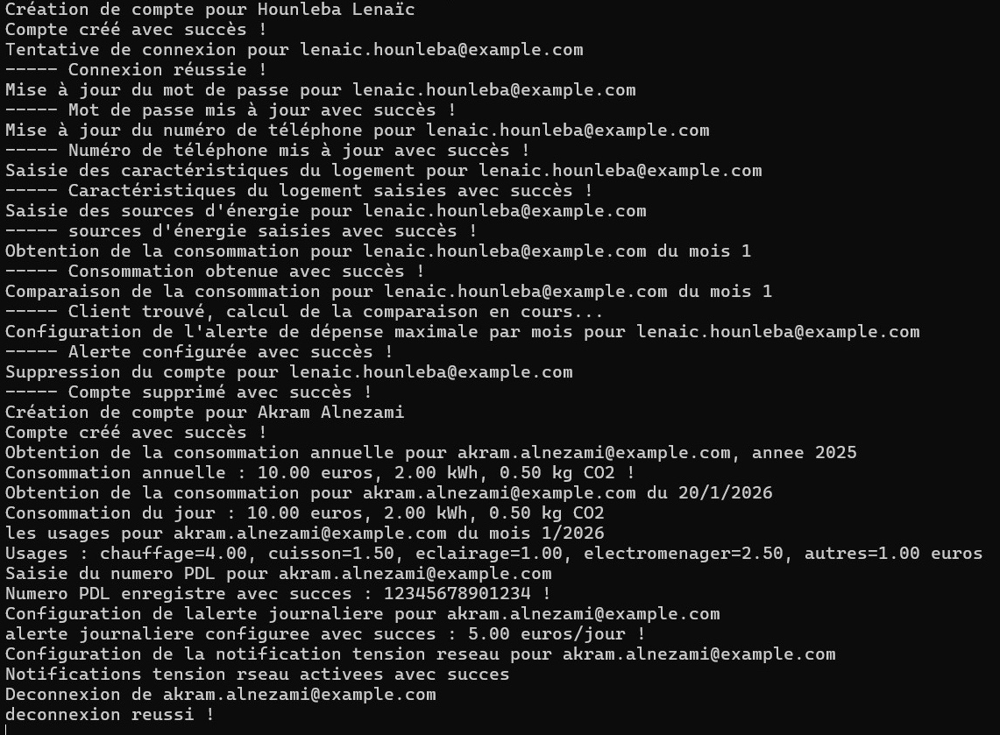
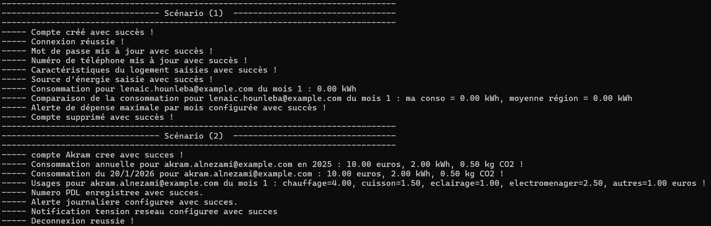

# ⚡ helloWattApp - RPC Energy Consumption Management Service


Client-server application developed in C with **rpcgen** (POSIX RPC), allowing a user to manage their account, their home and monitor their energy consumption remotely.

---

## 📌 Description

**helloWattApp** is an RPC service simulating an electricity consumption monitoring platform, inspired by services such as Linky/EDF. The client communicates with the server via remote procedure calls (RPC) to manage their profile and consult their consumption data.

The system is built around **17 RPC functions** split into two scenarios:

| Scenario | Functions |
|----------|-----------|
| 👤 Scenario 1 | Create an account, log in, change password and phone number, enter home and energy characteristics, view and compare monthly consumption, configure a monthly alert, delete account |
| ⚡ Scenario 2 | View annual and daily consumption, display usage by category, enter PDL number (Linky meter), configure a daily alert and a network voltage alert, log out |

---

## 🧩 Architecture

```
┌─────────────────────────────────────┐
│         hellowatt_client.c          │  ← client scenarios (RPC calls)
└──────────────────┬──────────────────┘
                   │ RPC calls (UDP)
┌──────────────────▼──────────────────┐
│         hellowatt_server.c          │  ← implementation of the 17 functions
└──────────────────┬──────────────────┘
                   │ generated by rpcgen from
┌──────────────────▼──────────────────┐
│            hellowatt.x              │  ← RPC interface (structs + program)
│   hellowatt.h · hellowatt_svc.c     │
│   hellowatt_clnt.c · hellowatt_xdr.c│
└─────────────────────────────────────┘
```

---

## 📁 Project Structure

```
projet-rpc/
├── codes/
│   ├── hellowatt.x           # RPC interface - structs and declarations of the 17 functions
│   ├── hellowatt.h           # generated by rpcgen
│   ├── hellowatt_svc.c       # generated by rpcgen - server main
│   ├── hellowatt_clnt.c      # generated by rpcgen - client stubs
│   ├── hellowatt_xdr.c       # generated by rpcgen - XDR filters (serialization)
│   ├── hellowatt_server.c    # manually written - implementation of the 17 functions
│   ├── hellowatt_client.c    # manually written - client scenarios
│   └── Makefile              # generated by rpcgen
├── exe-serveur.jpg           # screenshot of server-side execution
├── exe-client.jpg            # screenshot of client-side execution
├── model MCD.png             # conceptual data model
└── scenarios_hellowatt.pdf   # description of the two scenarios
```

---

## ⚙️ Tech Stack

- **Language** : C
- **Protocol** : RPC (Remote Procedure Call) via `rpcgen`
- **Transport** : UDP
- **Serialization** : XDR (External Data Representation)
- **OS** : Linux (Ubuntu / Lubuntu)
- **Libraries** : `libtirpc`, `libnsl`

---

## 🧠 Main Features

### Scenario 1 - Account and home management
- 🔐 Account creation and login with email + password
- ✏️ Update password and phone number
- 🏠 Enter home characteristics (address, area, type, structure)
- ⚡ Enter energy sources (heating, cooking)
- 📊 View monthly consumption (€, kWh, CO₂)
- 📈 Compare consumption with regional average
- 🔔 Configure a maximum monthly spending alert
- 🗑️ Permanent account deletion

### Scenario 2 - Advanced consumption monitoring
- 📅 View annual consumption (sum of all days)
- 🗓️ View daily consumption
- 🔌 Usage breakdown by category (heating, cooking, lighting, appliances, others)
- 🔢 Enter Linky meter PDL number
- 🔔 Configure a maximum daily spending alert
- ⚠️ Enable/disable network voltage notifications
- 🚪 Secure logout

---

## 🚀 Compilation and Execution

### Prerequisites
```bash
sudo apt install libtirpc-dev libnsl-dev
```

### Generate files from the .x
```bash
rpcgen -a hellowatt.x
```

### Update the Makefile
```makefile
CFLAGS += -g $(shell pkg-config --cflags libtirpc)
LDLIBS += -lnsl $(shell pkg-config --libs libtirpc)
```

### Terminal 1 - Compile and start the server
```bash
make hellowatt_server
./hellowatt_server
```

### Terminal 2 - Compile and start the client
```bash
make hellowatt_client
./hellowatt_client localhost
```

---

## 📸 Execution Preview

### Server side


### Client side


---

## 👥 Team

Project carried out as a duo as part of the **RIP/RPC** module - L3 Computer Science, Université de Bretagne Occidentale, 2025-2026.

---

## 👨‍💻 Author

**Lenaïc Love HOUNLEBA**

CEO & Full Stack Developer - [ComeUp](https://comeup.com/fr/@lenaic-1)  

🔗 [github.com/lenaic-hounleba](https://github.com/lenaic-hounleba)  
📧 lovehounleba@gmail.com

---

*Project carried out as part of the RIP/RPC module - L3 Computer Science, Université de Bretagne Occidentale, 2025-2026.*
